# 🧾 Service-Billing - Architecture Microservices avec Spring Cloud & Kafka

Ce projet démontre une architecture complète de microservices utilisant **Spring Boot**, **Spring Cloud**, **Apache Kafka**, et une interface **Angular**. Il inclut également un **Bot Telegram IA** avec capacités RAG (Retrieval-Augmented Generation) et un **Dashboard Analytics en temps réel**.


## 📸 Captures d'écran et Explications

### 1. Console H2 - Base de données Products (Inventory Service)


Affiche la table `PRODUCT` dans la base de données H2 en mémoire (`jdbc:h2:mem:product-db`). On peut voir 3 produits initialisés :
- **Computer** - 3200.00€, quantité: 11
- **Printer** - 3200.00€, quantité: 11  
- **Smart phone** - 3200.00€, quantité: 11

---

### 2. Console H2 - Base de données Bills (Billing Service)


Affiche la table `BILL` dans la base de données du Billing Service (`jdbc:h2:mem:bills-db`). Montre 3 factures générées automatiquement au démarrage, associées aux clients 1, 2 et 3.

---

### 3. Console H2 - Base de données Customers (Customer Service)


Affiche la table `CUSTOMER` avec 3 clients :
- **David** - david@gmail.com
- **Lina** - lina@gmail.com
- **Ayman** - ayman@gmail.com

---

### 4. Spring Boot Actuator - Health Check


Endpoint `/actuator/health` de l'Inventory Service montrant le statut **UP** - confirmant que le service fonctionne correctement.

---

### 5. Spring Boot Actuator - Beans


Endpoint `/actuator/beans` affichant tous les beans Spring enregistrés dans le contexte de l'application, incluant les configurations Eureka, LoadBalancer, et Discovery Client.

---

### 6. Eureka Dashboard - Services Enregistrés
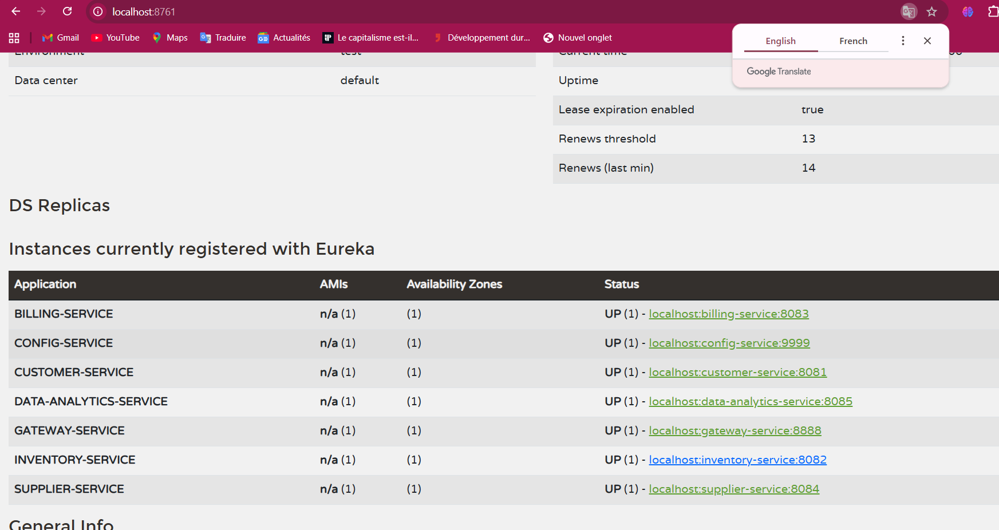

Dashboard Eureka montrant **7 microservices** enregistrés et actifs :
| Service | Port | Status |
|---------|------|--------|
| BILLING-SERVICE | 8083 | UP |
| CONFIG-SERVICE | 9999 | UP |
| CUSTOMER-SERVICE | 8081 | UP |
| DATA-ANALYTICS-SERVICE | 8085 | UP |
| GATEWAY-SERVICE | 8888 | UP |
| INVENTORY-SERVICE | 8082 | UP |
| SUPPLIER-SERVICE | 8084 | UP |

---

### 7. API Gateway - Liste des Customers
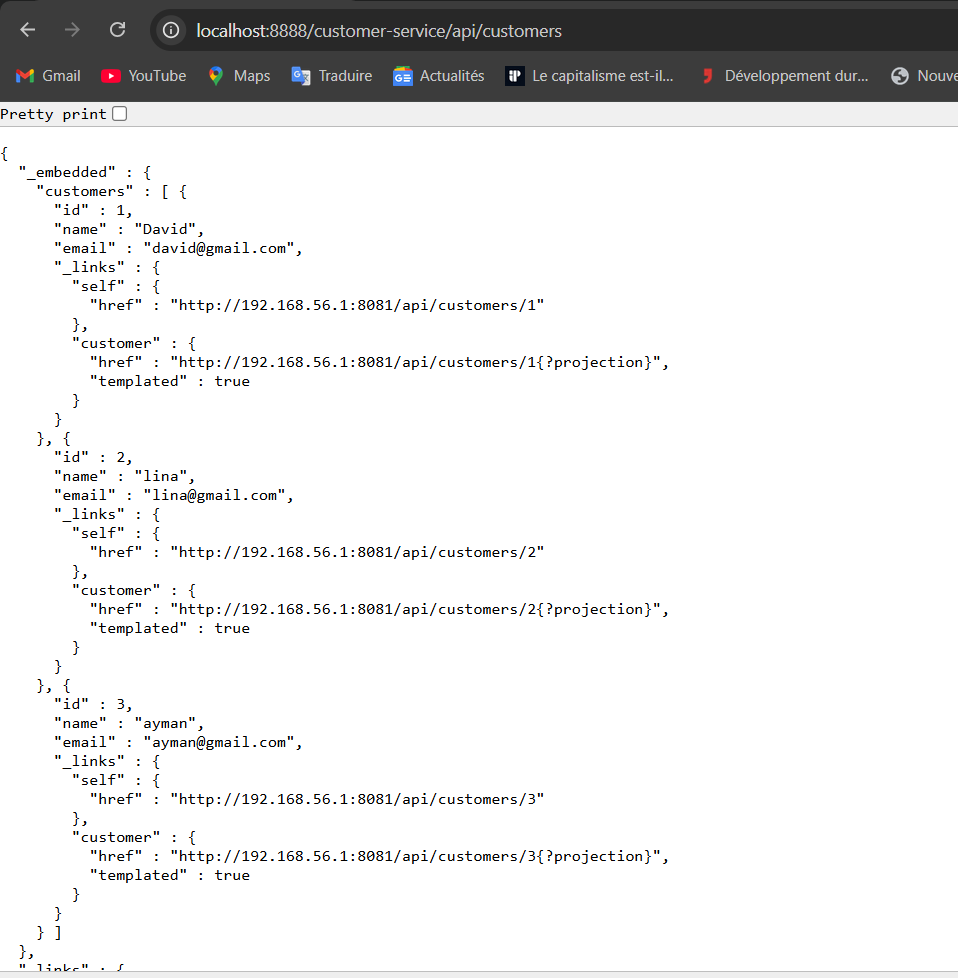

Réponse JSON de l'endpoint `localhost:8888/customer-service/api/customers` via le Gateway. Démontre le routage dynamique du Gateway vers le Customer Service avec le format HAL (Hypertext Application Language).

---

### 8. API Gateway - Liste des Products
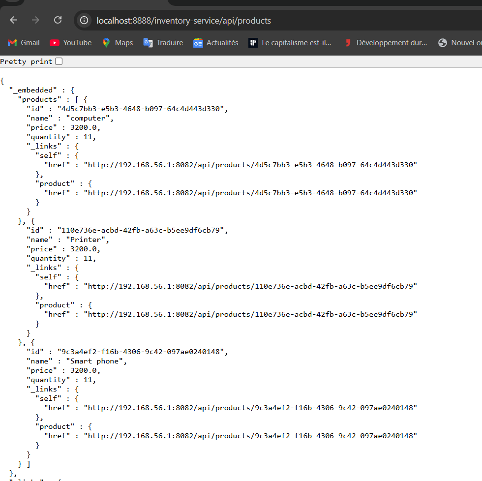

Réponse JSON de l'endpoint `localhost:8888/inventory-service/api/products`. Affiche les 3 produits avec leurs IDs UUID, prix et quantités.

---

### 9. API Gateway - Liste des Bills
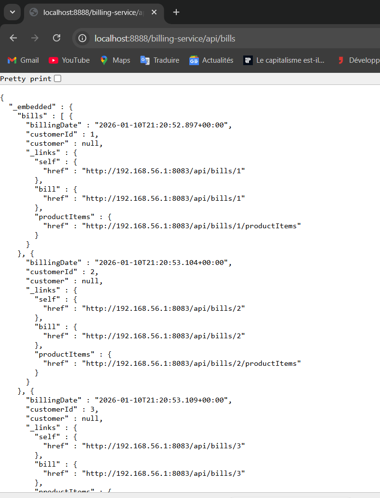

Réponse JSON de l'endpoint `localhost:8888/billing-service/api/bills`. Montre les factures avec liens HATEOAS vers les détails de la facture et les productItems associés.

---

### 10. Config Server - Configuration Application
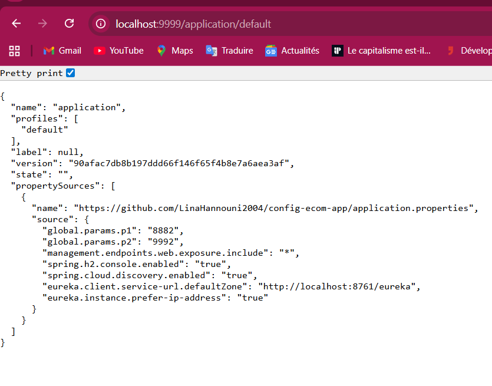

Endpoint du Config Server (`localhost:9999/application/default`) retournant la configuration centralisée depuis le repository Git GitHub. Inclut les paramètres globaux comme les URLs Eureka et H2 Console.

---

### 11 & 12. Spring Cloud Config - Tests de Configuration
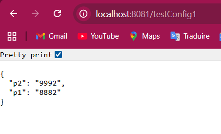
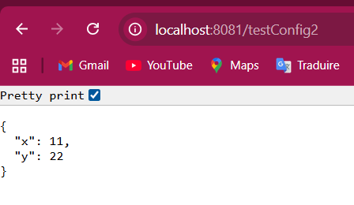

Endpoints de test démontrant l'injection de configuration depuis le Config Server :
- `testConfig1` : retourne les paramètres globaux (p1: 8882, p2: 9992)
- `testConfig2` : retourne les paramètres spécifiques au customer-service (x: 11, y: 22)

---

### 13 & 14. Gateway vers Config - Accès via Gateway
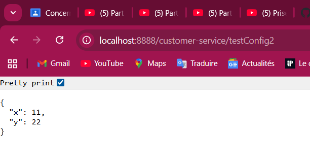
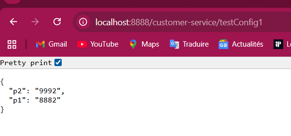

Même test de configuration mais accédé via le Gateway (`localhost:8888/customer-service/testConfig1`), démontrant le routage transparent du Gateway.

---

### 15. Angular Client - Page Bills (Recherche de Facture)
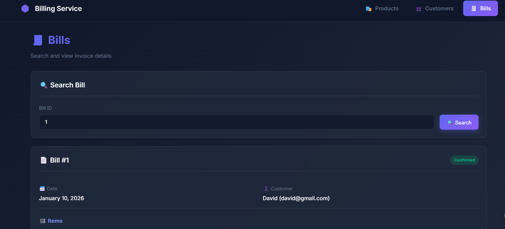

Interface Angular pour rechercher une facture par ID. Affiche les détails de la **Facture #1** :
- Date: 10 Janvier 2026
- Client: David (david@gmail.com)
- Statut: Confirmée

---

### 16. Angular Client - Détails d'une Facture
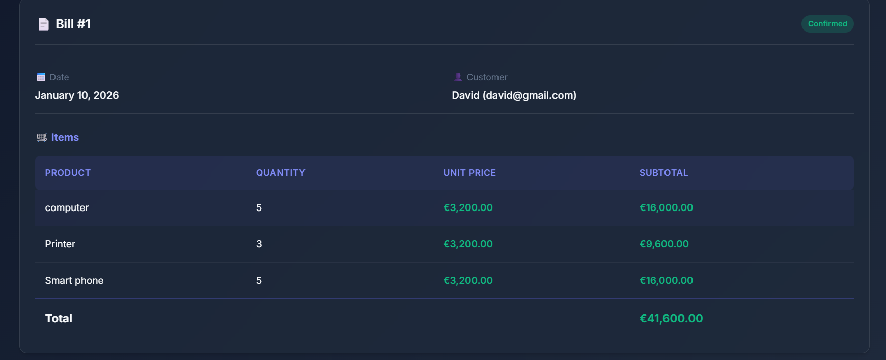

Détails complets de la facture avec les lignes de produits :
| Produit | Quantité | Prix Unitaire | Sous-total |
|---------|----------|---------------|------------|
| Computer | 5 | €3,200.00 | €16,000.00 |
| Printer | 3 | €3,200.00 | €9,600.00 |
| Smart phone | 5 | €3,200.00 | €16,000.00 |
| **Total** | | | **€41,600.00** |

---

### 17. Angular Client - Page Customers
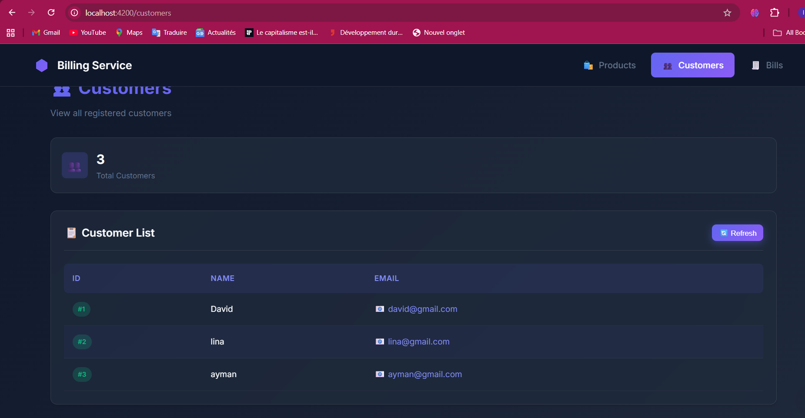

Liste des 3 clients enregistrés avec leurs emails. Interface moderne avec thème sombre et bouton Refresh.

---

### 18-21. Bot Telegram IA (EmsiAiBot) - Requêtes Employés
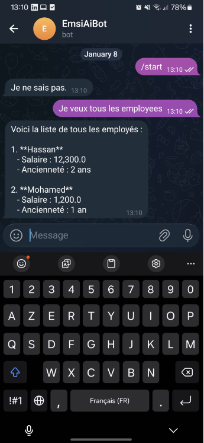


Démonstration du **Bot Telegram IA** utilisant des outils MCP (Model Context Protocol) pour interroger les données :
- Commande : "Je veux tous les employés"
- Réponse : Liste formatée des employés avec salaires et ancienneté
- Commande : "Je veux le salaire de Hassan"
- Réponse : "Le salaire de Hassan est de 12 300,0"

---

### 22. Bot Telegram - Analyse de Facture PDF (RAG)


Fonctionnalité **RAG (Retrieval-Augmented Generation)** :
- L'utilisateur envoie une image de facture
- Commande : "Montant de la facture et le nombre de produits"
- Réponse : "Le montant total de la facture est de 5 580 €. Le nombre total de produits est de 11."

---

### 23-24. Bot Telegram - Requêtes Clients & Produits


Interrogation des microservices via le bot :
- Liste des clients avec emails
- Recherche de client par ID
- Liste des produits disponibles avec prix et quantités
- Vérification de disponibilité produit

---

### 25-26. Bot Telegram - Détails Factures

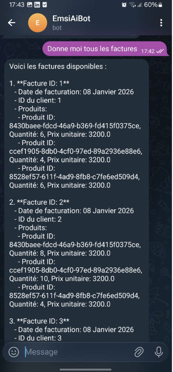

- Commande : "Donne moi le bill 1"
- Réponse détaillée avec date, client et liste des produits avec quantités
- Commande : "Donne moi tous les factures"
- Liste complète avec IDs produits et quantités

---

### 27. Bot Telegram - Analyse CV avec RAG


Fonctionnalité avancée **RAG avec PDF** :
- Upload d'un CV PDF
- Commande : "Donne moi un resumé du CV"
- Le bot analyse le PDF et génère un résumé détaillé du parcours professionnel

---

### 28-29. Kafka - Producer & Consumer Console
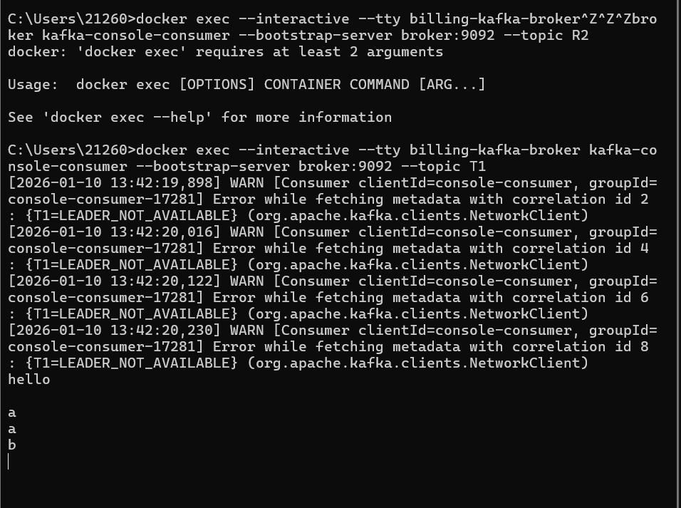
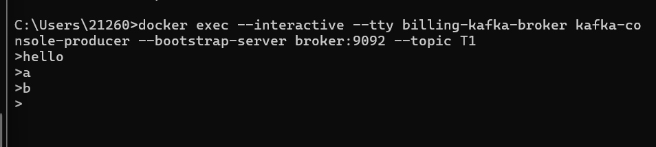

Démonstration de **Kafka** avec les outils console :
- **Producer** : Envoi de messages ("hello", "a", "b") sur le topic T1
- **Consumer** : Réception des messages en temps réel

---

### 30. Supplier Service - Publication d'événements
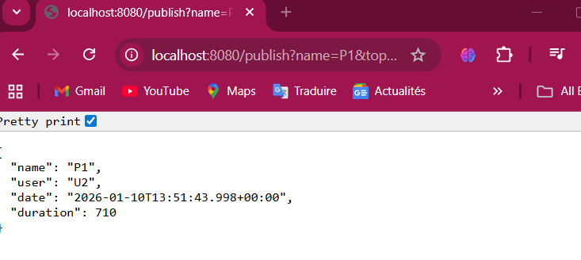

Endpoint du Supplier Service (`localhost:8080/publish`) qui publie des événements de page utilisateur avec :
- name, user, date, duration

---

### 31-32. Kafka Stream - Consommation d'événements
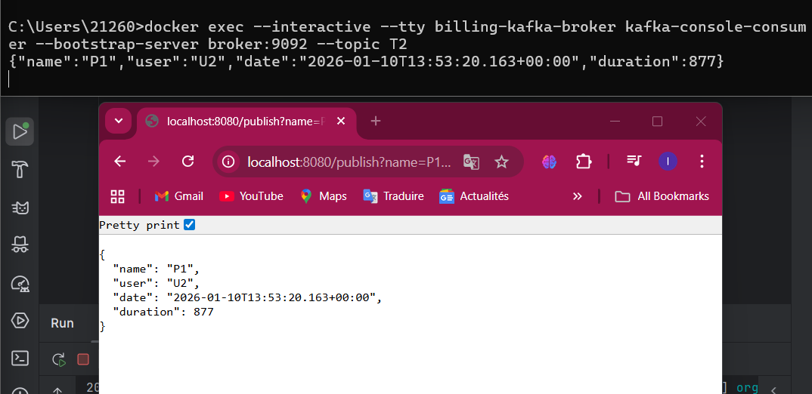
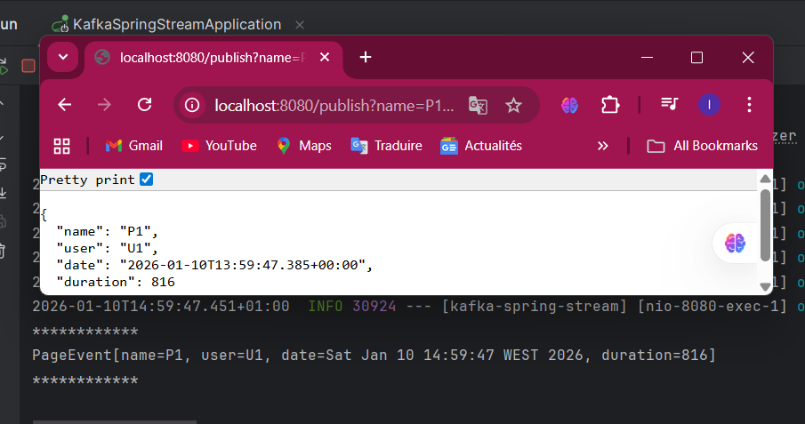

Consommation des événements Kafka Stream en temps réel, montrant les PageEvents avec durée de visite.

---

### 33. Kafka - Stream de données multi-topics
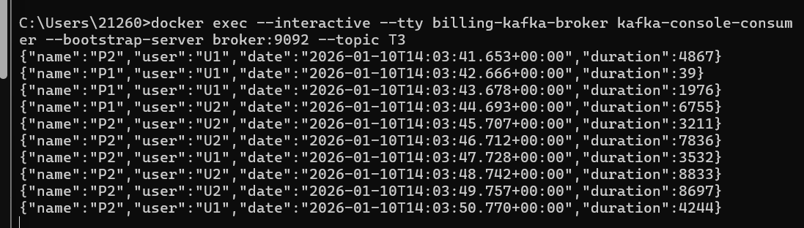

Consommation du topic T3 avec désérialisation personnalisée affichant les compteurs P1 et P2.

---

### 34. Kafka - Consumer avec propriétés custom
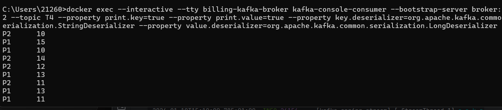

Consumer Kafka avec désérialisation String/Long pour les clés et valeurs, affichant les paires P1/P2 avec leurs valeurs.

---

### 35-36. Data Analytics Dashboard - Graphiques temps réel
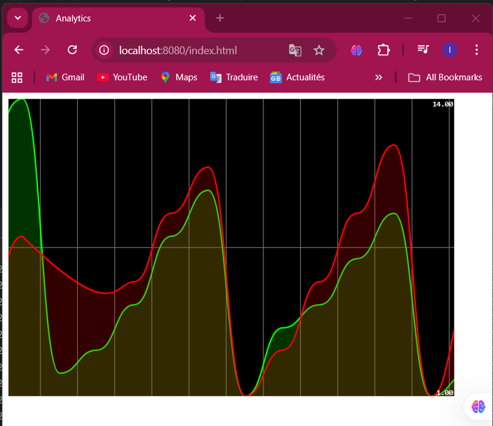
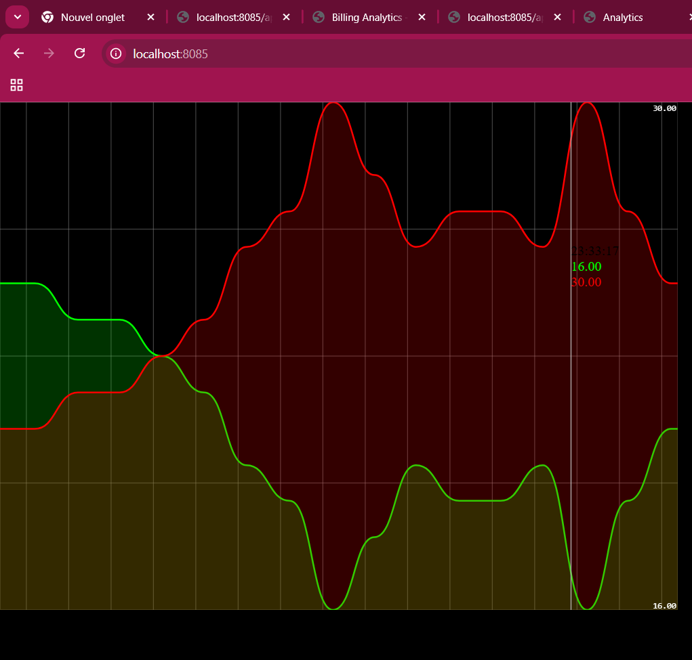

**Dashboard Analytics en temps réel** utilisant **Smoothie.js** :
- Graphique vert : Événements P1 (ORDER)
- Graphique rouge : Événements P2 (STOCK)
- Visualisation dynamique des taux d'événements sur une fenêtre temporelle

---

### 37. Analytics SSE Endpoint
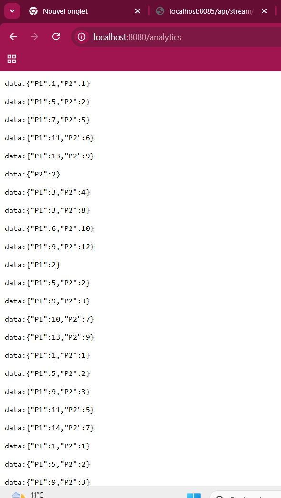

Endpoint SSE (Server-Sent Events) `localhost:8080/analytics` envoyant les compteurs en temps réel au format JSON.

---

### 38. Data Analytics Stream API
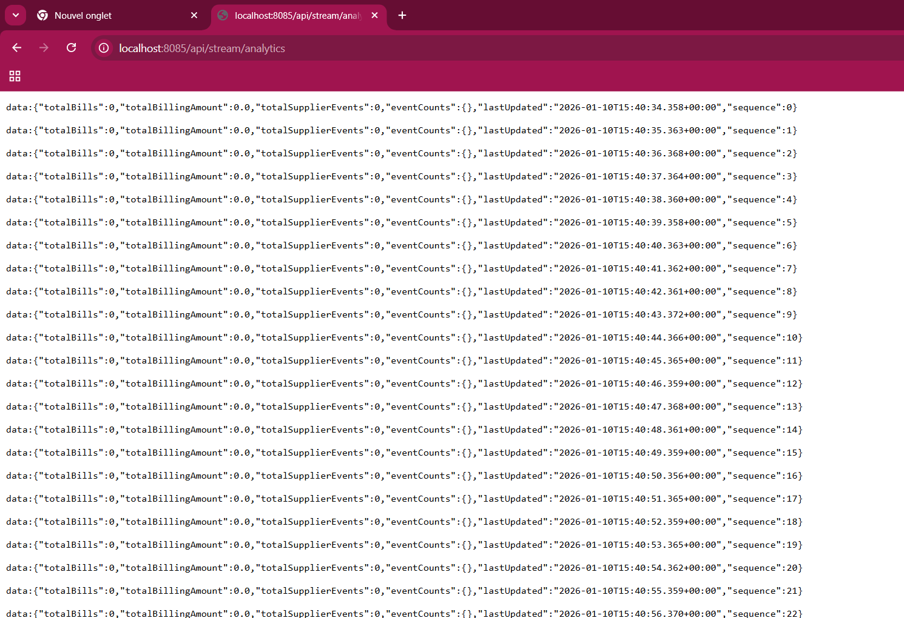

Endpoint de streaming `localhost:8085/api/stream/analytics` retournant les statistiques agrégées :
- totalBills, totalBillingAmount
- totalSupplierEvents, eventCounts
- lastUpdated, sequence number

---

## 🚀 Comment Exécuter

### 1. Démarrer l'infrastructure Kafka
```bash
cd d:\j2ee\Service-billing
docker-compose up -d
```

### 2. Démarrer les services (dans l'ordre)
```bash
# 1. Discovery Service (Eureka)
cd discovery-service && mvn spring-boot:run

# 2. Config Service
cd config-service && mvn spring-boot:run

# 3. Gateway Service
cd gateway-service && mvn spring-boot:run

# 4. Customer Service
cd customer-service && mvn spring-boot:run

# 5. Inventory Service
cd invetory-service && mvn spring-boot:run

# 6. Billing Service
cd billing-service && mvn spring-boot:run

# 7. Supplier Service (optionnel)
cd supplier-service && mvn spring-boot:run

# 8. Data Analytics Service (optionnel)
cd data-analytics-service && mvn spring-boot:run
```

### 3. Démarrer le client Angular
```bash
cd angular-client
npm install
ng serve
```

### 4. Accéder aux interfaces
- **Eureka Dashboard**: http://localhost:8761
- **Angular Client**: http://localhost:4200
- **Gateway API**: http://localhost:8888
- **Analytics Dashboard**: http://localhost:8085

---

## 🔧 Technologies Utilisées

| Catégorie | Technologies |
|-----------|-------------|
| **Backend** | Spring Boot 3.5.6, Spring Cloud 2025.0.0 |
| **Discovery** | Netflix Eureka |
| **Configuration** | Spring Cloud Config Server |
| **Gateway** | Spring Cloud Gateway |
| **Messaging** | Apache Kafka, Spring Cloud Stream |
| **Database** | H2 (in-memory) |
| **Frontend** | Angular 18, TypeScript |
| **AI/Bot** | Spring AI, MCP Protocol, Telegram Bot API |
| **Analytics** | SSE, Smoothie.js |
| **Container** | Docker, Docker Compose |

---

